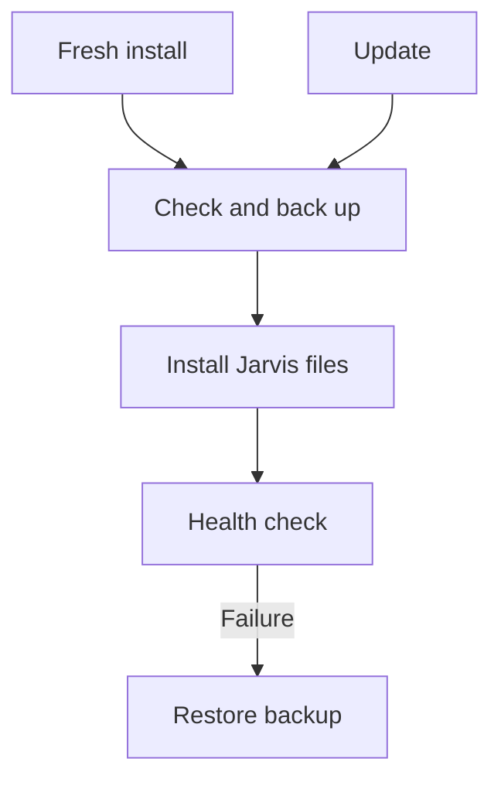

# Jarvis · OVOS Commands

Voice shortcuts and desktop control for Linux Mint. Jarvis handles reviewed
commands locally; an optional, local Qwen fallback can interpret a limited set
of enabled-app requests. It never executes a model-generated shell command.

> **V3 candidate:** This branch is being checked against the Brain and laptop.
> The [latest published release](https://github.com/evok3dx/OVOS-Commands/releases/latest)
> is the supported download until those checks finish. Linux Mint on X11 is
> the workstation target; other systems need their own acceptance test.

## Get started

For the published version, download its archive and matching `.sha256` from
[Releases](https://github.com/evok3dx/OVOS-Commands/releases/latest):

```bash
sha256sum --check ovos-commands-<version>.tar.gz.sha256
tar -xzf ovos-commands-<version>.tar.gz
cd ovos-commands-<version>
bash scripts/install.sh --check
bash scripts/install.sh
```

Replace `<version>` with the release shown on GitHub. In a trusted source
checkout, run `python3 scripts/validate_refactor.py` before installation.
`--check` is read-only. On a fresh workstation, the normal installer can offer
to prepare missing OVOS and basic desktop tools.



A fresh OVOS setup may request administrator access **once** for the official
OVOS installer and missing system tools. Daily use and Jarvis updates run as
your desktop user. Updates preserve your OVOS voice packages and models, wake
word and audio settings, saved applications, personal commands, shortcuts,
listening sound and private Brain helpers. They back up replaced Jarvis files;
`bash scripts/rollback.sh` restores the previous deployment.

## What you can do

| Area | Examples | Where to adjust it |
|---|---|---|
| Apps and windows | “Open Firefox”, “Focus Standard Notes”, “Close window” | Jarvis → Apps & Commands |
| Navigation and writing | “Page down”, “Top of page”, “New line” | [Command reference](docs/command-reference.md) |
| Voice | Wake phrase, listening shortcut, optional Speech Note | Jarvis → Voice |
| Maintenance | Health check, update status, settings export | Jarvis → Maintenance |

The **single tray icon** shows service, update and Jarvis microphone status.
The Control Centre keeps app selection, commands, voice settings and maintenance
in one window. Closing the tray window closes only the interface. The voice services keep running.

Settings export creates a private archive that you can inspect and restore
manually. It may contain credentials; keep it private. It does not include
models, recordings, applications or code, and it is separate from the
installer's automatic rollback backup.

### Optional local Qwen

Jarvis works without Ollama. To use the reviewed Qwen command fallback, check
the existing local model and pipeline first:

```bash
python3 scripts/qwen-setup.py
```

If the model is missing, you can download it deliberately with
`ollama pull qwen3:4b-instruct-2507-q4_K_M`. Run
`python3 scripts/qwen-setup.py --enable` **only after** the check reports the
model and both OVOS routing stages ready. The script refuses to overwrite a
different model choice. It neither installs Ollama nor changes voice packages.
The Ultra 9 has a small successful timing sample; the i7 still needs its own
real voice and latency check. [Local routing details](docs/04-local-routing.md).

## Guides

- [Architecture and components](docs/01-architecture.md)
- [Install, update and rollback details](docs/07-installer-updates.md)
- [Settings export and voice preservation](docs/09-backup-export.md)
- [Supported commands](docs/command-reference.md) · [Profiles and applications](docs/profiles-and-integrations.md)
- [Troubleshooting](docs/troubleshooting.md) · [Security and updates](docs/security-and-updates.md)
- [Living V3 audit](docs/v2.4-audit.md) · [Decisions](docs/12-decisions.md)

This is a small workstation project. Check the health report and try a few
spoken commands after updating either machine; an automated code check cannot
verify a microphone, GPU driver or external media provider for you.
