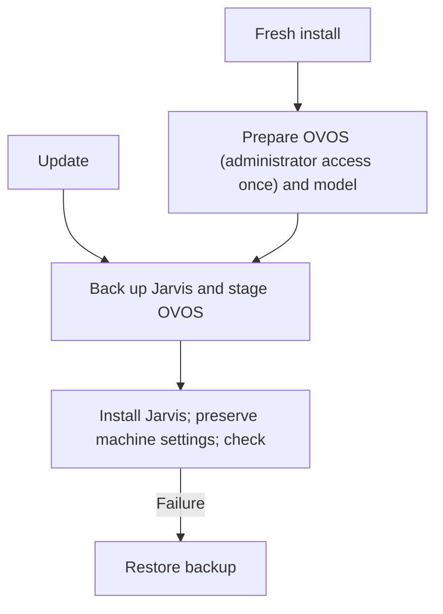

# Jarvis · OVOS Commands

Voice shortcuts and desktop control for Linux Mint. Jarvis handles reviewed
commands locally; the local Qwen model interprets a limited set
of enabled-app requests. It never executes a model-generated shell command.

> **Version 3.1.0:** Linux Mint on X11 with Python 3.11 is the workstation
> target. The separate Media and File Search plugins stay bundled. The first
> laptop installation is a supervised test of the Brain-compatible OVOS stack.

## Get started

For the published version, download its archive and matching `.sha256` from
[Releases](https://github.com/evok3dx/OVOS-Commands/releases/latest):

```bash
version=3.1.0
sha256sum --check "ovos-commands-$version.tar.gz.sha256"
tar -xzf "ovos-commands-$version.tar.gz"
cd "ovos-commands-$version"
bash scripts/install.sh --check
bash scripts/install.sh
```

In a trusted source checkout, run `python3 scripts/validate_refactor.py` before installation.
`--check` is read-only. On a fresh workstation, the normal installer can offer
to prepare missing OVOS and basic desktop tools.



A fresh OVOS setup may request administrator access **once** for the official
OVOS installer and missing system tools. The installer asks before downloading
the required local Qwen model; Ollama must already be installed and running.
Daily use and Jarvis updates run as your desktop user. This update stages the
tested Brain core, wake, speech and Bella package versions in a copy of the OVOS
virtualenv. It keeps the previous virtualenv for rollback and preserves local
models, wake and audio settings, saved apps, personal commands, shortcuts,
sounds and private Brain helpers. `bash scripts/rollback.sh` restores the
previous Jarvis deployment and OVOS virtualenv. See [exact pins and migration
details](docs/07-installer-updates.md).

## What you can do

| Area | Examples | Where to adjust it |
|---|---|---|
| Apps and windows | “Open Firefox”, “Focus Standard Notes”, “Close window” | Jarvis → Apps & Commands |
| Navigation and writing | “Page down”, “Top of page”, “New line” | [Command reference](docs/command-reference.md) |
| Media and files | “Play {title}”, “Pause music”, “Find {filename}” | Jarvis → Apps & Commands |
| Voice | Wake phrase, listening shortcut, optional Speech Note | Jarvis → Voice |
| Maintenance | Health check, update status, settings export | Jarvis → Maintenance |

The **single tray icon** shows service, update and Jarvis microphone status.
The Control Centre keeps app selection, commands, voice settings and maintenance
in one window. Closing the tray window closes only the interface. The voice services keep running.

Settings export creates a private archive that you can inspect and restore
manually. It may contain credentials; keep it private. It does not include
models, recordings, applications or code, and it is separate from the
installer's automatic rollback backup.

The model download is prompted only when missing. The installer checks the
local routing stages before enabling them. It leaves a different configured
model alone and stops for review. On the older i7, latency still needs a real
voice test. [Local routing details](docs/04-local-routing.md).

## Guides

- [V3.1 laptop test checklist](docs/v3.1-checklist.md) · [V3 features](docs/v3-update.md)
- [Architecture and components](docs/01-architecture.md)
- [OVOS voice and Brain media status](docs/06-ovos-voice.md)
- [Media and filename search](docs/10-media-files.md)
- [Install, update and rollback details](docs/07-installer-updates.md)
- [Settings export and voice preservation](docs/09-backup-export.md)
- [Supported commands](docs/command-reference.md) · [Profiles and applications](docs/profiles-and-integrations.md)
- [Troubleshooting](docs/troubleshooting.md) · [Security and updates](docs/security-and-updates.md)
- [Living V3 audit](docs/v2.4-audit.md) · [Detailed source reconciliation](docs/v3-final-audit.md) · [Decisions](docs/12-decisions.md)

This is a small workstation project. Check the health report and try a few
spoken commands after updating either machine; an automated code check cannot
verify a microphone, GPU driver or external media provider for you.
