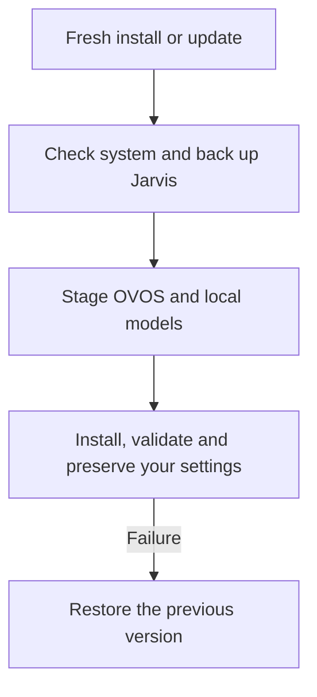

# Jarvis · Voice control for Linux Mint

Jarvis makes everyday desktop control feel natural while keeping execution
predictable. Exact OVOS commands run first. A local Qwen model can interpret
more relaxed wording, but it may choose only enabled, reviewed actions. It
never turns model output into a shell command.

## Why Jarvis

- **Local by default.** Wake word, speech recognition, routing and speech
  output run on your machine.
- **Natural without being unrestricted.** Say “open notes”, “look this up in
  Firefox” or “play Get Lucky” without giving an AI arbitrary computer access.
- **Personal.** Choose the apps behind Browser, Notes, Mail, Calendar and
  Office, add spoken names and keep your own commands.
- **Recoverable.** Updates stage and validate changes, preserve the working
  environment and retain rollback.
- **Visible.** One tray icon and one Control Centre show service, microphone
  and update state.

## Get started

Download the archive and matching `.sha256` from
[Releases](https://github.com/evok3dx/OVOS-Commands/releases/latest):

```bash
version=3.9.0
sha256sum --check "ovos-commands-$version.tar.gz.sha256"
tar -xzf "ovos-commands-$version.tar.gz"
cd "ovos-commands-$version"
bash scripts/install.sh --check
bash scripts/install.sh
```

`--check` is read-only. A fresh setup may request administrator access once
for the official OVOS installer and missing system tools. Jarvis itself,
normal updates and daily use run as your desktop user.


```mermaid
flowchart TD
  A["Fresh install or update"] --> B["Check system and back up Jarvis"]
  B --> C["Stage OVOS and local models"]
  C --> D["Install, validate and preserve your settings"]
  D -->|"Failure"| E["Restore the previous version"]
```

## Requirements and stack

The reviewed workstation target is Linux Mint, X11, x86_64 and Python 3.11.
Setup checks the machine, prepares the pinned OVOS/voice environment and guides
installation of Ollama plus the reviewed Qwen model. Exact versions and hashes
live in [`compatibility.json`](compatibility.json) and
[`voice/reviewed-stack.json`](voice/reviewed-stack.json), not in this overview.

| Layer | Local component |
|---|---|
| Listen | OpenWakeWord and Silero VAD |
| Understand speech | Faster-Whisper `small.en` |
| Match commands | Exact OVOS intents first, bounded Qwen fallback second |
| Act | Jarvis dispatcher plus separate Media and File Search skills |
| Speak | PhōnNX/Bella, with optional Speech Note reading and dictation |
| Manage | Combined tray, Control Centre, staged updates and rollback |

The Python package is also checked against Python 3.10–3.13, but that does not
replace full desktop and voice acceptance testing.

## Everyday controls

| Area | Examples | Configure |
|---|---|---|
| Applications | “Open Firefox”, “Open notes”, “Open mail” | Apps & Commands |
| Defaults | Choose Browser, Notes, Mail, Calendar and Office | Defaults |
| Writing | “Write this”, “Start writing”, “Full stop”, “Press space” | Commands |
| Windows | “Show desktop”, “Minimize all”, “Close window” | Commands |
| Reading | “Read this”, “Read this at 2x” | Voice and Speech Note |
| Media | “Play {title}”, “Play music”, “Pause music” | Media plugin |
| Files | “Find {filename}”, “Search my documents” | File Search plugin |
| Voice | Wake phrase, hotkeys and background-audio level | Voice |
| Startup (V4 candidate) | Auto-start quietly at login, or Run/Stop for this session | Overview |
| Updates | Installed version, release date, check and install | Updates |

The unpublished V4 candidate adds terminal-input protection, confirmation for
tool-capable agent messages, short-lived reading clipboard text and stronger
private-report/update checks. Earlier complete-runtime hash tests passed;
the restored candidate requires its full runtime artifact to be revalidated.
Live acceptance and core network isolation remain open;
see [security details](docs/security-and-updates.md) and the
[release record](docs/releases.md).

Fresh setup offers **Recommended**, **All** and **Custom** application modes.
Only detected and enabled applications enter the voice catalogue, Whisper
hints or Qwen action list. Changing a default never permits an unrelated app
or an arbitrary executable.

## What updates preserve

Jarvis preserves your OVOS configuration, downloaded models, selected apps,
default roles, spoken names, personal commands, shortcuts, listening sound,
voice packages and unlisted private helpers. The previous Jarvis deployment
and OVOS virtual environment remain available for rollback:

```bash
jarvis-health-check
jarvis-update check
jarvis-update rollback
```

Settings export is a separate, private backup. It may contain credentials, so
inspect it and keep it private. It is not yet a redacted portable export or an
automatic cross-machine import.

## Security boundary

- Qwen returns an action ID, never code, a command line or an arbitrary URL.
- Risky controls stay strict and pending typing is cancelled if focus changes.
- Discovered applications launch through their reviewed desktop entries.
- Configuration writes are private and atomic.
- Release archives have bounded size and structure and are checksum-verified.
- No new listening port is introduced. Ollama stays on its existing local
  endpoint.

X11 applications in the same desktop session can observe or inject input, so
X11 itself is not treated as a security boundary. See
[Security and updates](docs/security-and-updates.md) for the exact limits.

## Documentation

- [Commands](docs/command-reference.md) and [applications](docs/profiles-and-integrations.md)
- [Architecture](docs/01-architecture.md) and [local Qwen routing](docs/04-local-routing.md)
- [Voice stack](docs/06-ovos-voice.md) and [installer, updates and rollback](docs/07-installer-updates.md)
- [Backups and settings export](docs/09-backup-export.md)
- [Media and filename search](docs/10-media-files.md)
- [Troubleshooting](docs/troubleshooting.md) and [maintenance](docs/maintenance.md)
- [Security](docs/security-and-updates.md), [decisions](docs/12-decisions.md) and [release record](docs/releases.md)
- [Contributor and AI-agent rules](AGENTS.md)

## Licence and thanks

Jarvis is licensed under Apache-2.0. See [LICENSE](LICENSE) and
[acknowledgements](NOTICE.md) for the OpenVoiceOS, openWakeWord, Whisper, Qwen,
Ollama, PhōnNX, Speech Note and desktop projects that make it possible.
Third-party software and downloaded models retain their own licences.
