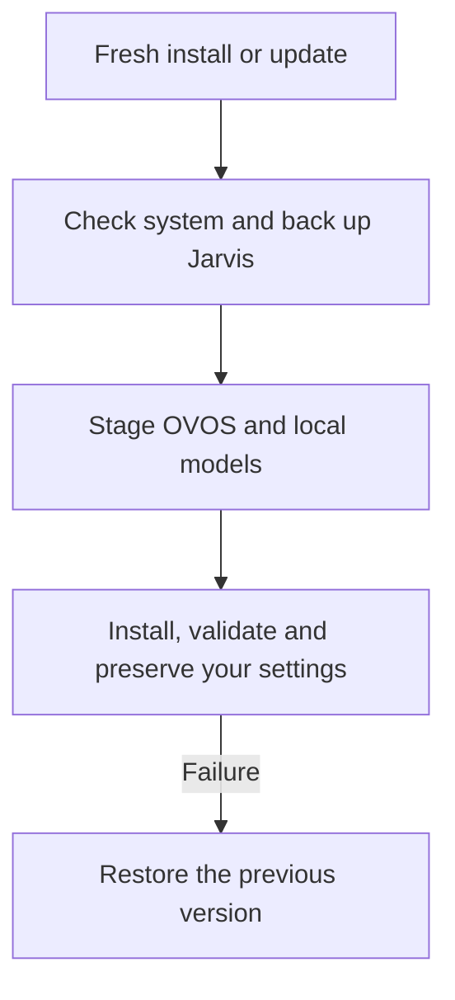

# Jarvis · Voice control for Linux Mint

Jarvis makes everyday desktop control feel natural while keeping execution
predictable. Exact OVOS commands run first. A local Qwen model can interpret
more relaxed wording, but it may choose only enabled, reviewed actions. It
never turns model output into a shell command.

## Why Jarvis

- **Local by default.** Wake word, speech recognition, routing and speech
  output run on your machine.
- **Natural without being unrestricted.** Say “open notes”, “look this up in
  Firefox” or “play Get Lucky” without giving an AI arbitrary computer access.
- **Personal.** Choose the apps behind Browser, Notes, Mail, Calendar and
  Office, add spoken names and keep your own commands.
- **Recoverable.** Updates stage and validate changes, preserve the working
  environment and retain rollback.
- **Visible.** One tray icon and a Light/Dark Control Centre show services,
  microphone, updates and private session activity.

## Get started

### Before you install

- Use **Linux Mint 22.x on X11, x86_64**, with a working microphone and audio
  output. Mint 22.3 is the reviewed desktop target. The current isolation setup
  requires Polkit's JavaScript rules backend; Mint 21.3's Polkit 0.105 is not
  supported for isolation. See [Requirements and stack](#requirements-and-stack).
- Have **CPython 3.11.16** available for the OVOS virtual environment, the exact Python
  version required by the reviewed runtime. A newer system Python does not
  replace this requirement; do not replace the operating system's Python. See
  [preparing Python](docs/07-installer-updates.md#preparing-python).
- Keep at least **8 GiB free** on the filesystem used for OVOS staging and
  rollback, plus room for voice models and Ollama's model storage. Ollama may
  store downloads on the root filesystem even when your home has free space.
- Install and start **Ollama** using its [Linux setup guide](https://docs.ollama.com/linux).
  Jarvis reuses an existing installation; it does not install Ollama.
- Allow internet access for the initial runtime and model downloads. Selected
  isolation is applied afterwards; it leaves general Ollama unchanged.
- Run Jarvis setup as your desktop user. Fresh system preparation and selected
  isolation may request bounded administrator approval. An absent OVOS baseline is prepared in user space; Speech Note is optional for reading and dictation.

For a **new installation**, check local Ollama and download the required model
before continuing. Already downloaded models are reused:

```bash
OLLAMA_HOST=http://127.0.0.1:11434 ollama list
OLLAMA_HOST=http://127.0.0.1:11434 ollama pull qwen3:4b-instruct-2507-q4_K_M
```

If a download fails, resolve the connection issue or retry later before
installing. Existing users should follow the [upgrade procedure](docs/07-installer-updates.md#upgrading-an-isolated-installation).

Download the archive and matching `.sha256` from
[Releases](https://github.com/evok3dx/OVOS-Commands/releases/latest):

```bash
version=4.4.4
sha256sum --check "ovos-commands-$version.tar.gz.sha256"
tar -xzf "ovos-commands-$version.tar.gz"
cd "ovos-commands-$version"
bash scripts/install.sh --check
bash scripts/install.sh
```

`--check` is read-only. Fresh setup prepares absent OVOS user services and an
ordinary-user virtual environment using the required interpreter. Missing OS
tools and selected isolation need bounded administrator approval. Jarvis itself,
normal updates and daily use run as your desktop user. See
[fresh installation](docs/07-installer-updates.md#fresh-installation).
Selected network isolation needs bounded administrator approval for service
data and a dedicated local model. Existing choices are preserved; see the
[upgrade procedure](docs/07-installer-updates.md#upgrading-an-isolated-installation)
before using the full installer or updater.
For an isolated 4.0.1/4.2.0 GUI upgrade, first apply the
[reviewed updater repair](docs/troubleshooting.md#isolated-gui-update-lock-conflict).


```mermaid
flowchart TD
  A["Fresh install or update"] --> B["Check system and back up Jarvis"]
  B --> C["Stage OVOS and local models"]
  C --> D["Install, validate and preserve your settings"]
  D -->|"Failure"| E["Restore the previous version"]
```

## Requirements and stack

The reviewed workstation target is Linux Mint 22.3, X11 and x86_64. Use Mint
22.x for the current native isolation setup, with a JavaScript-capable Polkit
backend and systemd network filtering. The release's managed voice runtime
requires CPython 3.11.16; its exact interpreter requirement is recorded in
[`voice/runtime-linux-x86_64-py311.json`](voice/runtime-linux-x86_64-py311.json).
Setup checks the machine, prepares the pinned OVOS/voice environment and reuses
an existing local Ollama installation. It asks before downloading a missing
reviewed Qwen model. Exact versions and hashes
live in [`compatibility.json`](compatibility.json) and
[`voice/reviewed-stack.json`](voice/reviewed-stack.json), not in this overview.

| Layer | Local component |
|---|---|
| Listen | OpenWakeWord and Silero VAD |
| Understand speech | Faster-Whisper `small.en` |
| Match commands | Exact OVOS intents first, bounded Qwen fallback second |
| Act | Jarvis dispatcher plus separate Media and File Search skills |
| Speak | PhōnNX/Bella, with optional Speech Note reading and dictation |
| Manage | Combined tray, Control Centre, staged updates and rollback |

The Python package is also checked against Python 3.10–3.13. Those package
checks do not change the managed runtime's exact Python requirement or replace
full desktop and voice acceptance testing.

## Everyday controls

| Area | Examples | Configure |
|---|---|---|
| Applications | “Open Firefox”, “Open notes”, “Open mail” | Apps & Commands |
| Defaults | Choose Browser, Notes, Mail, Calendar and Office | Defaults |
| Writing | “Write this”, “Start writing”, “Full stop”, “Press space” | Commands |
| Windows | “Show desktop”, “Minimize all”, “Close window” | Commands |
| Reading | “Read this”, “Read this at 2x” | Voice and Speech Note |
| Media | “Put on {title}”, “Play music”, “Pause music” | Media plugin |
| Files | “Find {filename}”, “Search my documents” | File Search plugin |
| Voice | Wake phrase, hotkeys and background-audio level | Voice |
| Startup | Start the app minimised and/or voice services at login; Run/Stop this session | General / Dashboard |
| Status | Speech, Listener and Commands; green health-check success, isolation policy and explicit network checks | Dashboard / Maintenance |
| Privacy | No logs by default, or Diagnostics for 5 minutes | General |
| Activity | Recent completed action labels, with Refresh; no transcripts | Dashboard |
| Updates | Installed version, release date, check and install | Updates |

Fresh setup offers **Recommended**, **All** and **Custom** application modes.
Only detected and enabled applications enter the voice catalogue, Whisper
hints or Qwen action list. Changing a default never permits an unrelated app
or an arbitrary executable.

## What updates preserve

Jarvis preserves your OVOS configuration, downloaded models, selected apps,
default roles, spoken names, personal commands, shortcuts, listening sound,
and unlisted private helpers. The managed runtime uses the release's reviewed
versions and hashes. The previous Jarvis deployment
and OVOS virtual environment remain available for rollback:

```bash
jarvis-health-check
jarvis-update check
jarvis-update rollback
```

Settings export is a separate, private backup. It may contain credentials, so
inspect it and keep it private. It is not yet a redacted portable export or an
automatic cross-machine import.

## Security boundary

- Qwen returns an action ID, never code, a command line or an arbitrary URL.
- Risky controls stay strict; writing rechecks focus and refuses terminal windows.
- Discovered applications launch through their reviewed desktop entries.
- Configuration writes are private and atomic.
- General offers No logs or five-minute diagnostics with fixed failure reasons; spoken and
  written content is excluded. Diagnostics expire and clear even with the GUI
  closed. See the [logging limits](docs/security-and-updates.md#application-logging-in-43).
- Temporary reading text is cleared; the previous clipboard is never restored.
- Tool-capable private-agent messages require readback and single-use confirmation.
- All 296 runtime packages have exact versions and enforced wheel hashes.
- Updates require reviewed HTTPS hosts, checksums and bounded archive extraction.
- Optional native isolation restricts core/listener/audio and a dedicated local
  model; weather and browser music retain separate online paths.
- Maintenance shows configured isolation policy. **Check isolation** tests the
  current workers and private model; a policy indicator alone is not proof of
  blocked network access. See [GUI status and checks](docs/core-isolation.md#control-centre-status-and-checks).
- The [guided isolation installer](docs/core-isolation.md#guided-installer-401)
  offers isolation recommended for new installs and preserves existing choices.
  Its dedicated loopback model instance leaves general Ollama unchanged.
  [Live checks](docs/releases.md) verify local generation and the tested
  IPv4/IPv6 network restrictions.

Recent Activity is a separate, temporary list of reviewed action labels. It
works with No logs selected and displays the last five minutes. Existing logs,
exported reports and other applications have their own retention rules.

X11 applications in the same desktop session can observe or inject input, so
X11 itself is not treated as a security boundary. See
[Security and updates](docs/security-and-updates.md) for the exact limits.
Runtime wheels can be retained for offline use; voice/Qwen models and OS tools
are separate. Checksums verify bytes; production signing remains future work.

## Documentation

- [Commands](docs/command-reference.md) and [applications](docs/profiles-and-integrations.md)
- [Architecture](docs/01-architecture.md) and [local Qwen routing](docs/04-local-routing.md)
- [Voice stack](docs/06-ovos-voice.md) and [installer, updates and rollback](docs/07-installer-updates.md)
- [Backups and settings export](docs/09-backup-export.md)
- [Media and filename search](docs/10-media-files.md)
- [Troubleshooting](docs/troubleshooting.md) and [maintenance](docs/maintenance.md)
- [Security](docs/security-and-updates.md), [decisions](docs/12-decisions.md) and [release record](docs/releases.md)
- [V4.4.0 release notes](docs/release-v4.4.0.md) and [service isolation](docs/core-isolation.md)
- [Contributor and AI-agent rules](AGENTS.md)

## Licence and thanks

Jarvis is licensed under Apache-2.0. See [LICENSE](LICENSE) and
[acknowledgements](NOTICE.md) for the OpenVoiceOS, openWakeWord, Whisper, Qwen,
Ollama, PhōnNX, Speech Note and desktop projects that make it possible.
Third-party software and downloaded models retain their own licences.
